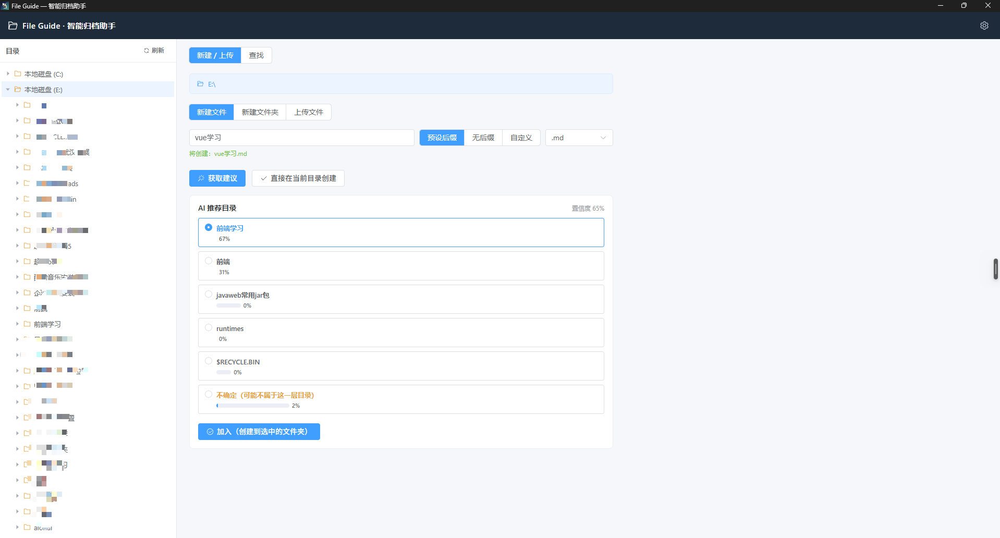
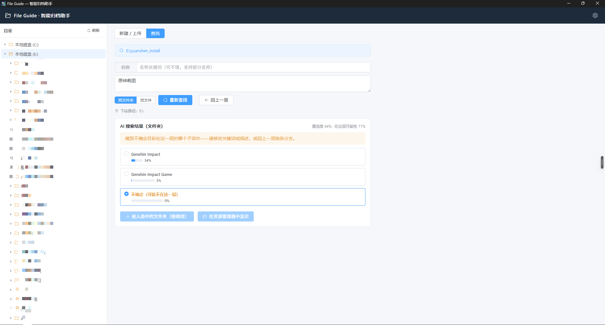

# File Guide · 智能归档助手

基于 **Electron + Vue 3 + TypeScript + TypeSafe（Jev / System One）** 的 Windows 桌面应用：在浏览本机目录的同时，借助 AI 对"新建的文件该放在哪""要找的文件在哪一层"做出结构化判断，并以概率 + 置信度的形式呈现给用户。

---

## 一、项目介绍

### 核心能力

**1. 目录浏览（左侧）**

- 启动时自动检测系统真实盘符（A–Z 逐个探测，失败时回退显示 C/D/E/F）
- 树形懒加载；同时显示文件夹与文件
- 图标体系：文件夹（展开/收起两态）、按后缀分类的文件图标（图片 / 视频 / 音频 / 压缩包 / Word / Excel·CSV / PPT / PDF / 代码·配置 / 纯文本 / exe·msi）、未识别类型的兜底灰色图标
- 文件节点**不可选中、不可展开**，仅作视觉参考
- **双击打开**：双击任意节点（文件夹或文件）即以系统默认方式打开——文件夹在资源管理器中打开该文件夹，文件用默认关联程序打开

**2. 新建 / 上传（右侧「新建 / 上传」页签）**

- 三种模式：新建文件、新建文件夹、上传已有文件（复制进目标目录）
- 文件名校验（渲染进程实时提示 + 主进程落盘前二次校验，同一套规则）：
  - Windows 非法字符 `<>:"/\|?*` 与控制字符
  - 保留设备名 CON、PRN、AUX、NUL、COM1-9、LPT1-9
  - 不能只由点号组成、不能以点号/空格结尾、长度 ≤ 255
  - 文件后缀三种模式：预设后缀（txt/md/docx/xlsx/pptx/pdf/csv/json/js/ts/vue/html/css/py/zip/png/jpg 等）、无后缀、自定义后缀（自动补前导点，1–16 位字母数字/下划线/连字符）
  - 上传时按源文件名自动推断后缀模式，名称可改
- **AI 归档建议**：点击「获取建议」，把当前目录下的子文件夹作为 Choice 候选发给 TypeSafe，模型返回"这个名称最该放进哪个子文件夹"。展示 **Top5 推荐 + uncertain（不确定）行 + 每项概率 + 置信度**；模型选 uncertain 或置信度低（< 40%）时提示"该名称可能不属于这一层目录，请换目录重试"。用户点选推荐文件夹后「加入」即在该文件夹下创建；也提供「直接在当前目录创建」。名称相近、拿不准该放进哪个时，可「进入子目录」跳到候选文件夹下、「返回上一层」回到父目录（两者都会自动重新发起一次推荐）、「在资源管理器中打开」核对（双击推荐项也可直接打开）。顶部路径栏右侧有「编辑」按钮，可直接输入目录路径（如 `D:\分盘软件`）跳转到任意目录

  

  *示例：输入名称「vue学习.md」并点击「获取建议」后，AI 推荐目录按概率排序（前端学习 67% / 前端 31% / … / 不确定 2%），点选推荐项后点击「加入」即可创建到该文件夹。*

**3. 一键查找（右侧「查找」页签 · 默认，全自动）**

解决"文件千千万、只记得大概，但不想一步步点"的查找问题——只给两样信息：**名称关键词**（可选）+ **大概是干啥的**（可选），系统**全自动**完成下钻探索，一次性返回 **Top10 最相关的文件/文件夹**（混合排序，可切换纯文件 / 纯文件夹），全程无需人工参与：

- 算法：目录树上的 **best-first 搜索（优先队列式 beam search）**，每个目录一次 TypeSafe 调用并行评估三类问题：
  - **pick**（Choice）：目标最可能是本层哪个直接子项？（>250 候选自动分批）
  - **container**（Choice）：目标若不在直接子项里，最可能在哪个子文件夹的更深层？（决定下钻分支）
  - **target_here**（Noul）：目标就在这层直接子项中吗？
- 所有超过噪声门槛（1%）的分支进**全局优先队列**、每轮并行评估 Top2——排名靠后的分支不会在浅层被丢掉，只要预算够就有机会被探索；预算约束：最多 24 次 API 调用 / 深度 6 层，用满预算才停
- 命中得分 = **层内概率 × 路径因子的深度几何折损**（pathFactor^(1/深度)），跨层可比且不歧视深埋目标，据此取全局 Top10
- 文件夹候选**全量**附带子项名称采样（不截断），让模型能判断"这个文件夹大概是干啥的"；提示词明确"名称可能是拼音或英文（原神 = Genshin Impact = yuanshen），按内容/用途匹配而非名称字面相似"
- 实时进度回报（正在看哪个目录、已用几次调用）；结果展示每项概率、路径得分、深度与「在资源管理器中显示」

**4. 逐层查找（右侧「查找」页签 · 手动模式）**

解决"文件千千万、只记得大概"的查找问题——把全局搜索分解为**逐层下钻**（架构参考 TypeSafe 官方 [Hierarchical Classification](https://docs.typesafe.ai/cookbooks/hierarchical_classification)）：

- 输入：名称关键词（可选）+ 自然语言特征描述（可选），至少填一项
- 每层一次 API 调用，包含两类问题（并行评估）：
  - **Choice**：目标最可能是本层哪个子项？
  - **Noul**：目标真的可能在这一层吗？（低分时明确提示"换分支"）
- 候选超过 250 个时自动**分批并行**（每批一个 Choice 问题，单次调用最多 4 批 = 1000 个候选）
- 有名称关键词时先**本地预筛**（子串匹配），缩短短名单、节省 token；文件模式下无关键词且候选 > 300 会提示补充关键词
- 展示 Top5 + uncertain；支持「进入选中的文件夹」继续下钻、「回上一层」回溯；找到目标后「在资源管理器中显示」，或**双击结果项**直接打开（文件夹→资源管理器、文件→默认程序）
- **token 约束**：左侧切换目录只切换搜索起点，绝不自动发起请求；每次 API 调用都由用户主动点击按钮触发

  

  *示例：以描述「原神截图」在 E:\yuanshen_install 下查找文件夹——AI 给出候选概率（Genshin Impact 34% / …）、置信度与"在这层可能性"，模型没把握时自动选中「不确定」并提示换关键词或回上一层换分支。*

**5. 设置**

- 右上角齿轮填入 TypeSafe API Key，保存在本机用户数据目录 `config.json`
- Key 仅由主进程读取用于请求；渲染进程永远只能拿到掩码（如 `sk-****abcd`）

### 为什么是 TypeSafe / System One？

TypeSafe 的 Jev 模型不是"生成文本再解析"，而是直接对**类型化问题**返回**结构化结果**（`choice` / `probabilities` / `confidence` / `noul`）：

- `Choice`：候选文件夹/文件作为 `criteria`，返回完整概率分布——天然适合"从列表里选一个"
- `Noul`：是/否判断——天然适合"目标是否在这一层"的门卫检查
- 多个问题可在**一次调用内并行**评估，分批探索几乎不增加延迟

---

## 二、启动与打包

### 环境要求

- Node.js ≥ 20（开发时使用 v22 验证）
- Windows 10/11（盘符检测、路径校验按 Windows 规则实现）
- TypeSafe API Key（[console.typesafe.ai/keys](https://console.typesafe.ai/keys) 获取，应用内设置即可）

### 安装依赖

```bash
npm install
```

项目根目录 `.npmrc` 已将 Electron 及 electron-builder 二进制指向国内镜像（npmmirror），无需额外配置。若首次 `npm install` 后 Electron 二进制缺失（报 `Error: Electron uninstall`），手动补一次：

```bash
$env:ELECTRON_MIRROR='https://npmmirror.com/mirrors/electron/'
node node_modules/electron/install.js
```

### 开发模式

```bash
npm run dev
```

- 启动 Vite dev server + Electron，渲染进程支持 HMR 热更新
- 主进程 / preload 改动会自动重建并重启应用（若未自动重启，手动重启 `npm run dev` 即可）
- 开发模式下额外开启 CDP 调试端口 `9222`（`remote-debugging-port`），可用 DevTools / 自动化脚本检查渲染进程；打包产物不受影响

### 类型检查

```bash
npm run typecheck        # 主进程(tsc) + 渲染进程(vue-tsc) 两侧全查
npm run typecheck:node   # 仅主进程 + preload + shared
npm run typecheck:web    # 仅渲染进程
```

### 生产构建

```bash
npm run build            # 仅构建到 out/（main / preload / renderer），不打包安装程序
```

### 打包 Windows 安装程序

```bash
npm run build:win
```

- 使用 electron-builder（NSIS 安装包），产物输出到 `dist/`：
  - `dist/File Guide-0.1.0-setup.exe` —— 安装程序
  - `dist/win-unpacked/` —— 免安装绿色目录（内含 `File Guide.exe`）
- 安装包允许自定义安装目录、自动创建桌面快捷方式
- 注意：打包需要下载 NSIS / winCodeSign 工具链，`.npmrc` 中的镜像配置已覆盖；若你的**全局** `~/.npmrc` 还残留旧 `npm.taobao.org` 域名（该域名已停用），请迁移到 `npmmirror.com`，否则打包阶段会因证书不匹配而失败

---

## 三、架构

### 技术栈

| 层 | 选型 |
|---|---|
| 桌面框架 | Electron 44 |
| 构建工具 | electron-vite 5（Vite 7） |
| 前端 | Vue 3.5 + Element Plus 2.14 + @element-plus/icons-vue |
| 语言 | TypeScript 5.9（严格模式，tsc + vue-tsc 双侧类型检查） |
| AI | TypeSafe System One API（model: `jev-latest`） |

### 目录结构

```
file-guide/
├─ electron.vite.config.ts      # 三段构建配置（main/preload/renderer）+ @shared 别名
├─ package.json                 # scripts + electron-builder 配置（build 字段）
├─ .npmrc                       # Electron / electron-builder 二进制国内镜像
├─ docs/                        # README 截图（新建推荐 / 逐层查找示例）
└─ src/
   ├─ shared/                   # ★ 主进程与渲染进程共用（双端 import 同一份）
   │  ├─ types.ts               #   IPC 返回结构 ApiResult<T>、FsNode、Suggest/Search 载荷与结果、预设后缀表
   │  └─ validate.ts            #   文件名/后缀校验规则（渲染进程实时提示 + 主进程落盘前复检）
   ├─ main/                     # 主进程（Node 环境，所有 fs/网络/对话框都在这里）
   │  ├─ index.ts               #   窗口创建、IPC 注册、统一错误包装、dev 模式 CDP 端口
   │  ├─ config.ts              #   API Key 持久化（userData/config.json），对外只出掩码
   │  ├─ fsService.ts           #   盘符检测、listFolders/listEntries、创建/复制、错误码翻译
   │  ├─ typesafe.ts            #   systemOneRequest（鉴权/超时/HTTP错误统一处理）+ 新建建议（Choice + uncertain）
   │  ├─ search.ts              #   逐层查找（Choice + Noul、本地预筛、>250 分批并行）
   │  └─ autoSearch.ts          #   一键查找：beam search 全自动下钻（pick + container + Noul，Top10）
   ├─ preload/
   │  ├─ index.ts               #   contextBridge 暴露类型化 FileGuideApi（IPC 唯一通道）
   │  └─ index.d.ts             #   Window.api 全局类型声明
   └─ renderer/                 # Vue 3 渲染进程
      ├─ index.html             #   CSP 元数据
      └─ src/
         ├─ main.ts             #   Element Plus 全量注册（含样式）+ 全局图标
         ├─ App.vue             #   布局：顶栏 + 左树 + 右侧页签（新建/上传 | 查找）+ 设置对话框
         ├─ utils/
         │  └─ fileIcons.ts     #   后缀 → 图标/颜色 映射（含兜底）
         ├─ components/
         │  ├─ SidebarTree.vue  #   懒加载目录树（文件禁用、自定义节点图标）
         │  ├─ ActionPanel.vue  #   新建/上传面板 + AI 归档建议（Top5 + uncertain + 加入）
         │  ├─ AutoSearchPanel.vue # 一键查找面板（关键词/描述 → 自动下钻 → Top10 结果 + 进度）
         │  ├─ SearchPanel.vue  #   查找页签（一键/逐层两种模式切换）+ 逐层查找面板（下钻、回溯、定位）
         │  └─ SettingsDialog.vue # API Key 设置
         └─ assets/main.css     #   全局样式
```

### 进程模型与 IPC 契约

```
┌──────────────────────────────┐
│ 渲染进程 Vue 3               │
│ （无 Node 权限，只认 Window.api）│
└──────────────┬───────────────┘
               │ contextBridge（preload，唯一通道）
┌──────────────▼───────────────┐
│ 主进程                        │
│  ipcMain.handle 注册表        │──► fsService（盘符/目录/创建/复制）
│  统一返回 ApiResult<T>：      │──► config（API Key）
│  { ok, data }                │──► typesafe / search（HTTPS → api.typesafe.ai）
│  或 { ok:false, code, msg }  │
└──────────────────────────────┘
```

安全基线：`contextIsolation: true`、`sandbox: true`、`nodeIntegration: false`；渲染进程不接触文件系统、网络与 API Key 明文。

### IPC 通道一览

| 通道 | 作用 |
|---|---|
| `app:getConfig` / `app:setApiKey` | 读取（掩码）/ 保存 API Key |
| `fs:getDrives` | 盘符检测 |
| `fs:listFolders` | 列子文件夹（TypeSafe 候选专用） |
| `fs:listEntries` | 列全部条目（目录树展示，含文件） |
| `fs:resolveDir` | 校验并规范化手动输入的目录路径（路径栏「编辑」跳转） |
| `fs:parentDir` | 取父目录（根目录返回 null）——「返回上一层」 |
| `fs:pickSourceFile` | 系统文件选择对话框（上传模式） |
| `fs:commit` | 创建文件 / 文件夹 / 复制上传文件（落盘前二次校验） |
| `fs:reveal` | 在资源管理器中显示目标 |
| `fs:open` | 双击打开目标（文件夹→资源管理器窗口，文件→系统默认程序） |
| `typesafe:suggest` | 新建建议：当前目录子文件夹 → Choice（含 uncertain） |
| `typesafe:searchStep` | 逐层查找单步：Choice（>250 分批）+ Noul 门卫 |
| `search:auto` | 一键查找：beam search 全自动下钻，返回全局 Top10 |
| `search:autoProgress` | 一键查找进度事件（主进程 → 渲染进程推送，随 `search:auto` 生命周期收发） |

### TypeSafe 请求示例（新建建议）

```jsonc
POST https://api.typesafe.ai/v1/systemone
{
  "state": "用户当前浏览的目录：“E:\\edu-rag”。用户想在这个目录下新建一个文件，拟用名称：“search.vue”。…",
  "model": "jev-latest",
  "questions": {
    "best_folder": {
      "type": "choice",
      "instructions": "新文件的名称最应该放入下面哪个子文件夹？如果无法确定或都不匹配，请选择 uncertain。",
      "criteria": {
        "frontend": "子文件夹 “frontend”",
        "backend": "子文件夹 “backend”",
        "uncertain": "不确定：无法确定该名称最属于以上哪个子文件夹…"
      }
    }
  }
}
// 响应：answers.best_folder = { choice, confidence, probabilities: { frontend: 0.93, backend: 0, …, uncertain: 0.07 } }
```

查找（`searchStep`）在同一次调用里并行问 `best_0…best_n`（分批 Choice）与 `target_here`（Noul），响应合并逻辑见 [src/main/search.ts](src/main/search.ts)。一键查找（`autoSearch`）在同一调用里并行问 `pick_0…pick_n`（分批 Choice）、`container`（Choice）与 `target_here`（Noul），beam search 的推进与合并逻辑见 [src/main/autoSearch.ts](src/main/autoSearch.ts)。

### 关键设计决策

- **校验双写**：同一份校验代码（`src/shared/validate.ts`）在渲染进程做实时反馈、主进程做落盘前复检，两端规则永不漂移
- **IPC 全量 `ApiResult` 包装**：渲染进程不需要 try/catch，错误码（`NO_API_KEY` / `API_KEY_INVALID` / `ALREADY_EXISTS` / `TOO_MANY_CANDIDATES`…）直接映射为中文提示
- **IPC 传参禁用响应式对象**：Vue 的 Proxy 无法结构化克隆（会报 `An object could not be cloned`），跨 IPC 的数组一律浅拷贝
- **查找的 token 约束**：目录切换只换起点不触发请求；本地预筛先行；文件模式无关键词且候选过多时直接拒绝，杜绝无效消耗
- **树形分解 + 官方并行批处理**：255 选项上限是"每题"的，逐层下钻把它变成每层约束；超限用同调用多 question 并行分批
- **一键查找的得分口径与预算**：层内概率跨目录不可直接比较，命中得分 = 层内概率 × 路径因子的深度几何折损（pathFactor^(1/深度)）折算为全局可比得分再取 Top10——既跨层可比，又不像连乘那样把深埋目标压出榜单；best-first 优先队列 + 24 次调用 / 深度 6 的预算防止 token 失控，预算耗尽时明确提示"仍有分支未探索"
